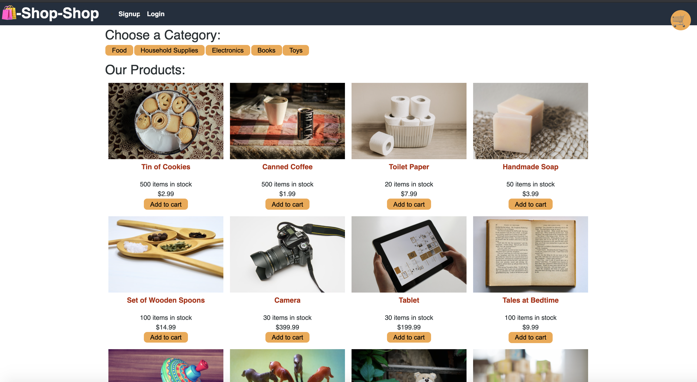
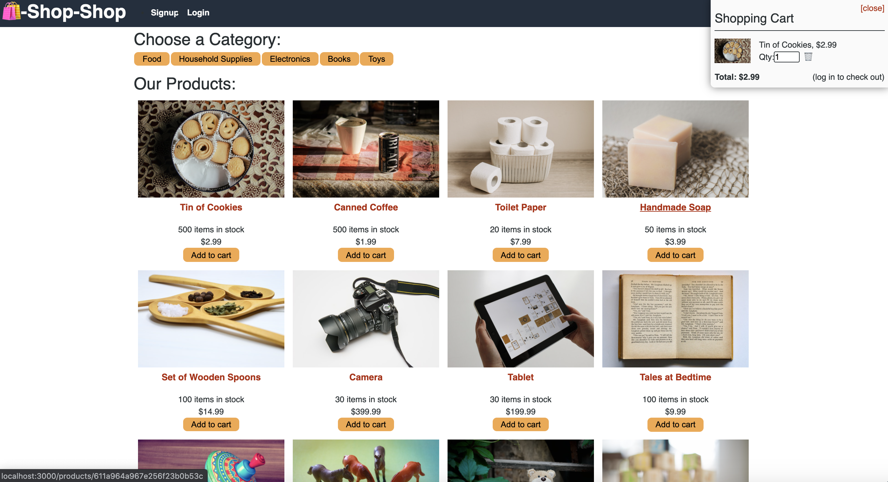
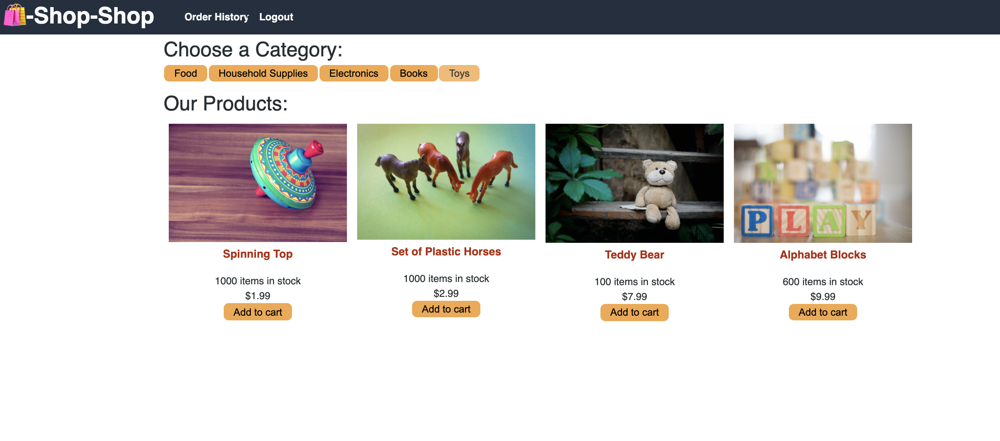
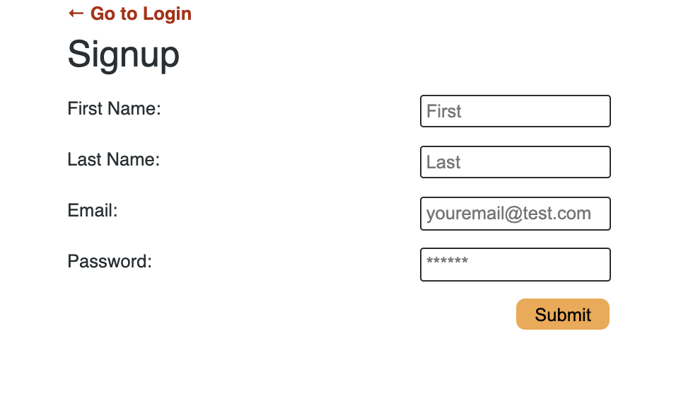
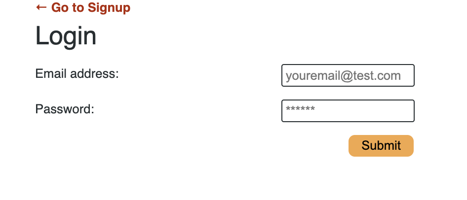
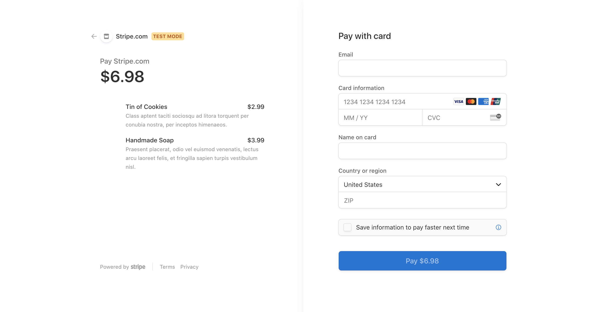

# Redux Store

### Table of Contents
- [Description](#Description)
- [License](#license)
- [Technologies Used](#Technologies-Used)
- [Installation](#installation)
- [How to Use](#how-to-use)
- [Screenshots](#screenshots)
- [Contributors](#contributors)
- [Sources](#sources)

## Description
This is an e-commerce website allowing the user to shop for items based on category. Users must log in to purchase the items. There is an option to signup if there is no account. If there is an account, they can log in.

## License
[](https://opensource.org/licenses/ISC)

## Technologies Used
```
HTML JavaScript

CSS (Provided to me)

Node.JS
Express.JS
Mongoose
MongoDB
Bcrypt
Jsowebtoken
React
Redux
Stripe
Graphql

```
## Installation
To install the application, 
1. Fork the repository
2. Install all independencies using
```
npm install
```
3. Seed the provided database with the included data using
```node seeders/seed.js
```
4. Start the Server using
```
npm run develop
```
5. Once the server is running, go to your web browser and view the application at http://localhost:3001/

## How to Use
This application is simple to use. It resembles a website similar to Amazon, Ebay, or any other sites where there's a shopping cart. The user must signup in order to order items. They can view items by category. They can add items to their cart. Once they sign up, they can chekout and view the page to process a payment.

## Screenshots
This is the main screen where user can view items and tabs to shop by category. t


This is the main page that shows the shopping cart in the top right corner.


This is the toy category page after the toy tabe was selected.


This is the signup page that users can fill out to make an account.


This is the login page that users can fill out to log in.


Here is the page of the payment page.


## Contributors
- Stephanie Davis

## Questions
If you have any questions, please feel free to contact me. 
- GitHub: [whatawhat](www.github.com/whatawhat) to visit my repository
- Email: stephedavis12@gmail.com

